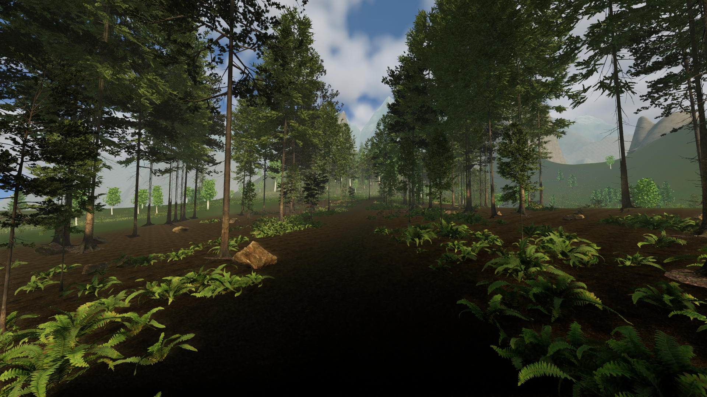
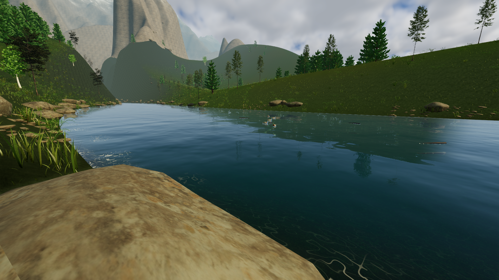
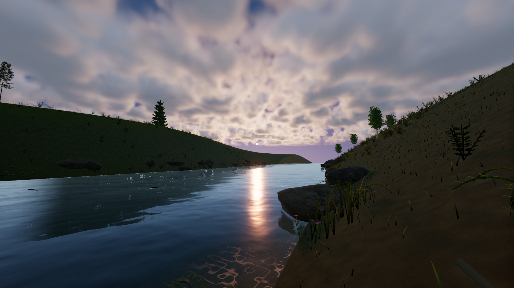

# Lighting, landscapes and moving hair

High now prioritizes visual detail. It uses curved grass across both riverbanks, more riverbank pine groves and undergrowth, lit two-sided leaves, and connected angular mountain faces. Mountain shading uses physical surface lighting and shadows. Raised rock surfaces remain solid where they meet the original terrain.

The sky integrates three-dimensional cloud density and shadowing, with separate atmospheric scattering terms and a lower evening sun. Woodland mist receives sunlight and tree shadows. A live HDR reflection probe captures the changing sky and scenery. This remains an approximation of atmospheric transport, not a complete multiple-scattering or global-illumination system.

Water reflects visible banks and trees using depth tracing, then blends to the environment probe where the trace lacks reliable information. Depth absorption, refraction, shallow caustics, contact foam and existing interactive waves remain part of the river. Reflections are filtered to avoid alternating dark bank hits and bright sky misses. Offscreen objects cannot be reconstructed by screen-space tracing.

Animal coats use six-segment constrained guides, strand-oriented highlights and backlighting. High draws up to 5,400 clumps per coat instead of 1,800. Horses have 370 mane and tail guides; explorers have 110 loose hair guides. Roots follow the animated body parts, with wind, inertia, length constraints and a local skin-plane constraint. The mane follows precombed arcs around the authored neck, deformed by bounded simulated tip motion. This keeps a coherent groom without feeding surface corrections back into the solver. This is articulated ribbon hair. It does not implement strand-to-strand collisions or a full scalp/body collision volume.

High uses SMAA and 8× MSAA. An initial TAA capture had poor fine-foliage coverage, and the moving materials do not yet supply complete motion-vector data. The spatial methods preserve moving silhouettes without relying on that missing data. Geometry and shading budgets increased for this pass; the proposed minimum PC remains unverified.

Use **High** in Escape settings. **F8** enters Fern Hollow and **F7** visits the river. Choose evening or changing weather in Escape. **F4** chooses an explorer, and **H** rides the horse. Existing ranch activities and saved resources are unchanged.

## Research

The implementation draws on current Unity 6.3 documentation and published techniques. Each note separates implemented work from techniques that were evaluated but not implemented.

- [Lighting and clouds](lighting-research.md)
- [Hair physics and shading](hair-research.md)
- [Water rendering](water-research.md)
- [Terrain and vegetation](landscape-research.md)

## Captured in the game

[High motion recording](benchmarks/cinematic-high-motion.mp4) · [Low motion recording](benchmarks/cinematic-low-motion.mp4) · [Horse and explorer hair](benchmarks/cinematic-western-hair-hair.mp4)

The clips use fixed simulation steps to document animation, not to measure performance. See the [validation ledger](first-milestone.md) for the exact tested state and remaining limits.
