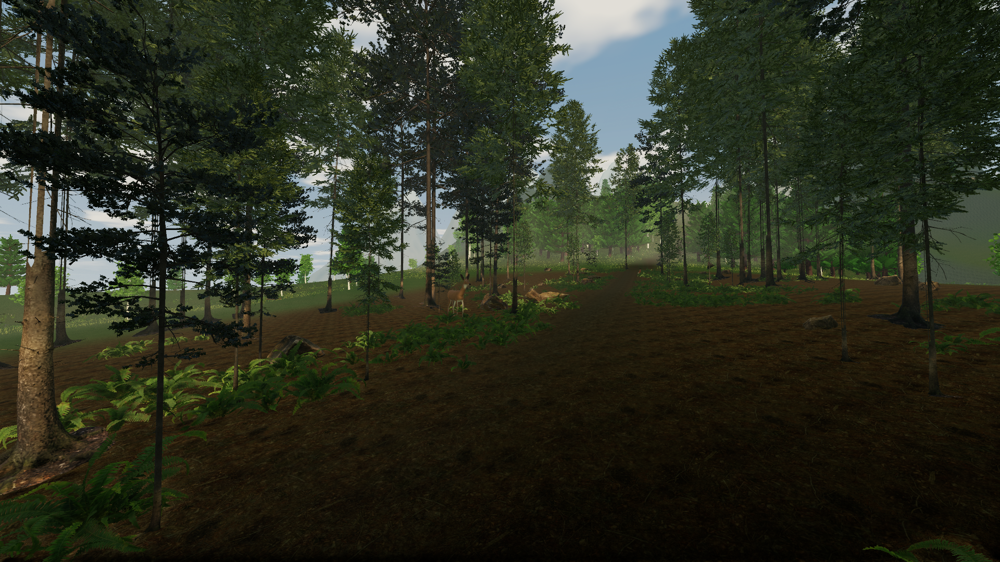
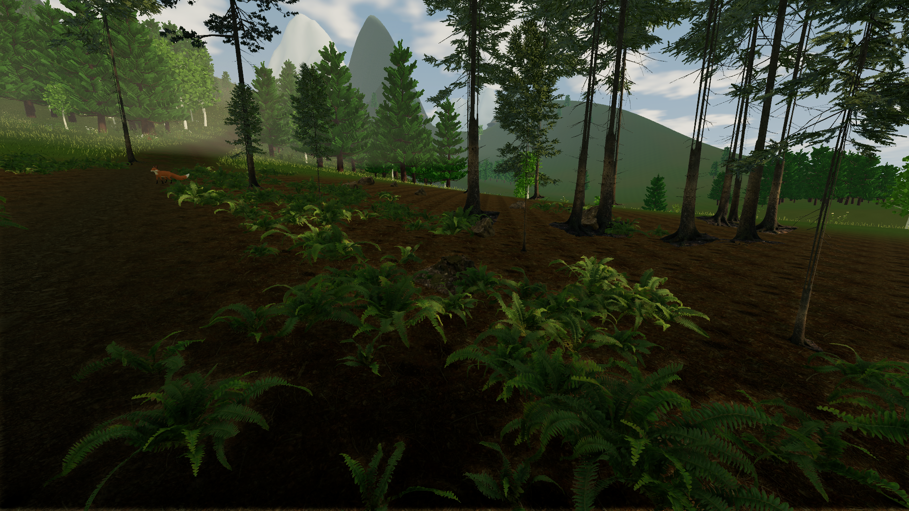

# Fern Hollow

Press F8 in the game to enter the focused woodland scene. F9 hides the HUD; Home returns to the ranch.

This pass concentrates the visual work on about 100 metres of trail. The grove uses Poly Haven pine and fir trees, scanned ferns, stumps and mossy rocks, and photographed ground surfaces. Young trees and fern patches close the gaps around the path. A separate doe study adds quiet head and ear motion beside the trail. Existing meadow deer still roam west of the grove.

The scene keeps the existing terrain heights, ranch saves and multiplayer rules. Low quality retains the grove's trees, plants and doe, with simpler distant meshes and fewer lighting effects. The rest of Pinewatch still uses the earlier prototype art.

## Player captures

Unedited Linux player captures, using the normal first-person camera:





[Entrance view](benchmarks/grove-entrance.png) · [720p Low on integrated graphics](benchmarks/grove-low.png)

## Asset sources

Poly Haven distributes these source assets under [CC0](https://polyhaven.com/license). Download tools use its public API. Powered by Poly Haven. Source URLs and checksums are in [tree provenance](reference-trees.json) and [ground provenance](reference-ground-assets.json). Their website preview renders are not bundled. The distributed screenshots come from our player.

The [doe source and references](../ArtSource/ReferenceDeer/README.md) document original Blender geometry and coat textures. Its adult silhouette and mesh intersections improved, but its face and coat still look procedural at close range. It is not finished realistic animal art.

## Reproduce the inspection

Build the Linux player, then run:

```sh
python3 .agents/tools/grove-capture.py --quality high
python3 .agents/tools/grove-capture.py --quality low
.agents/tools/benchmark.sh high '' grove
.agents/tools/benchmark.sh low 1 grove
```

Capture mode uses the real first-person camera at four fixed trail positions, with clear daylight and isolated saves and preferences. The benchmark follows 72 metres of this grove after five seconds of warm-up. Its timing samples are engine frame intervals, not GPU timer measurements.

The [validation ledger](first-milestone.md) records the tested source state, platform checks and hardware limitations.
