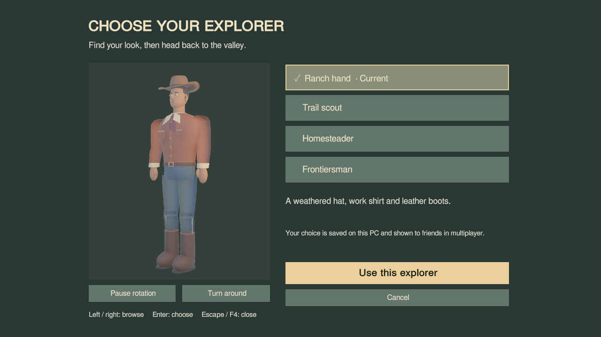
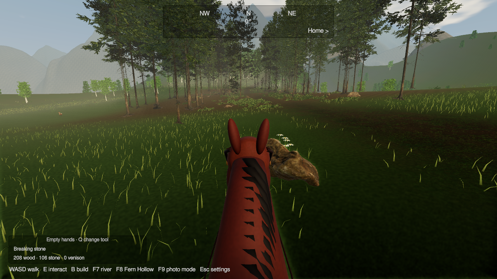

# Explorer outfits and frontier tools

F4 opens a rotating preview of four original western outfits: ranch hand, trail scout, homesteader and frontiersman. Confirming saves the choice on this PC. Other players see outfit changes without reconnecting. The models use articulated rigid parts, with walking motion and a seated pose. They are stylized original art, not scanned humans.

Q cycles hands, axe, pickaxe and muzzleloader. Look at gathering timber or stone near the ranch and left-click. Each timber site gives eight wood; each rock site gives six stone. Sites recover after one minute. Supplies are shared and saved. Foundations cost eight wood and four stone; walls and roofs cost six wood. Moving is free and dismantling returns the original cost. Existing saves receive 200 wood and 100 stone once.

The muzzleloader fires with left-click, aims with right-click and reloads with R. Its eight-second animation includes recoil, smoke, moving hands, hammer and ramrod. It is an illustrative game prop with rigid hand meshes, not a historical replica or a finger-animation system.

Hunting is off by default. The field journal offers a shared ranch toggle. With hunting enabled, designated deer in the western meadow yield two venison and recover after two minutes. Players, horses and farm animals cannot take damage. Shooting with hunting off remains harmless. Deer disappear without graphic injury effects; there is no carcass or butchery system.

H mounts your personal horse when nearby and dismounts onto clear ground. WASD rides, Shift canters, and Home returns the player to the meadow. The horse avoids deeper water. Its position is local and resets when the scene loads; other players see your horse and seated model while you ride. The compass shows cardinal directions, heading and the home bearing.

Original editable assets and provenance: [players](../ArtSource/Players-provenance.md), [tools](../ArtSource/FrontierTools-provenance.md), and [horse Blender source](../ArtSource/Horse.blend). The horse has 29,806 triangles. Players have approximately 13,400–17,800 triangles including outfit variants; these first models do not yet have authored distance LODs. [FBX export checks](../ArtSource/frontier-export-validation.json).

[Controls and saves](morning-playtest.md) · [Validation ledger](first-milestone.md)

## Captured in the player

[High reload recording](benchmarks/frontier-high-reload.mp4) · [Low reload recording](benchmarks/frontier-low-reload.mp4). These are fixed-step animation captures, not performance benchmarks.
