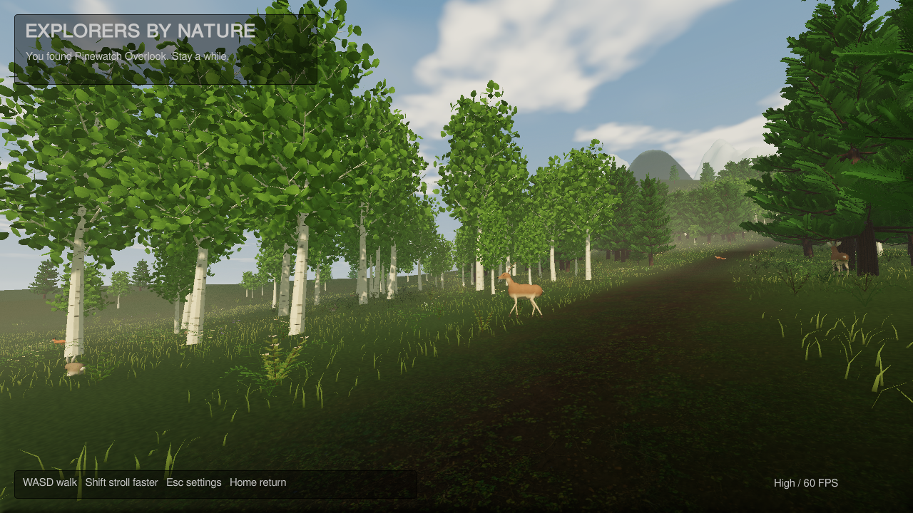
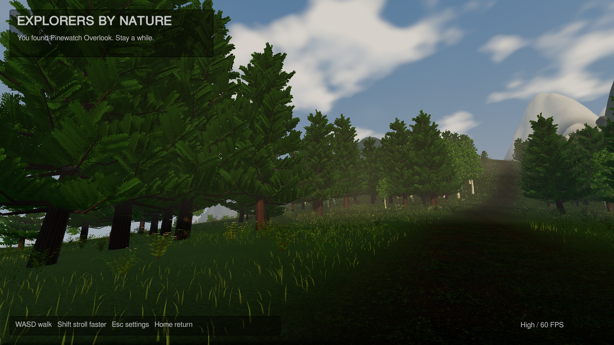
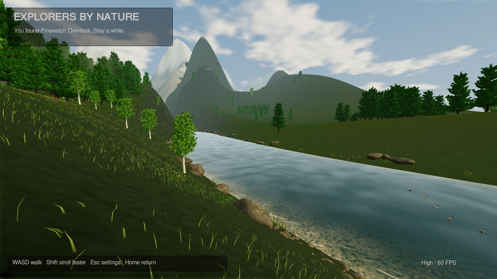
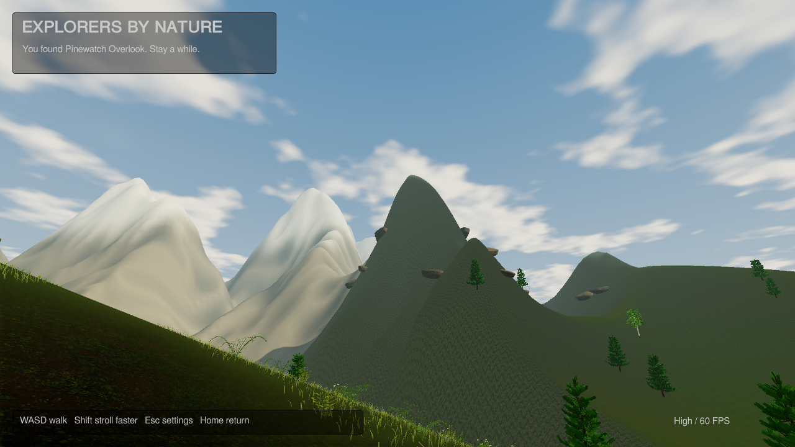
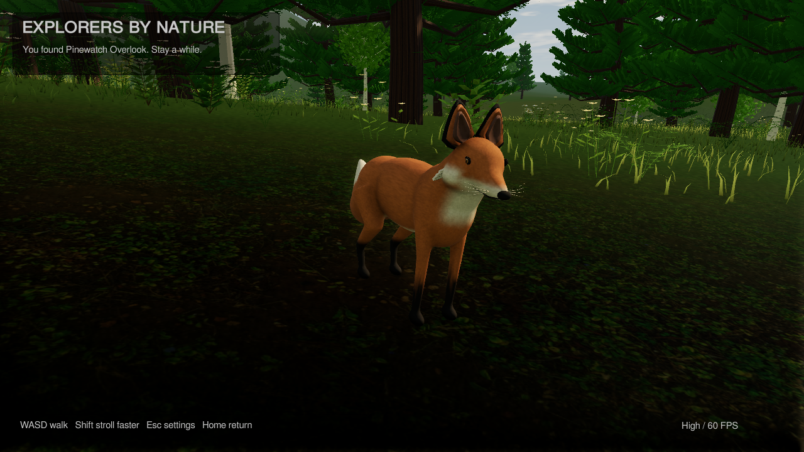
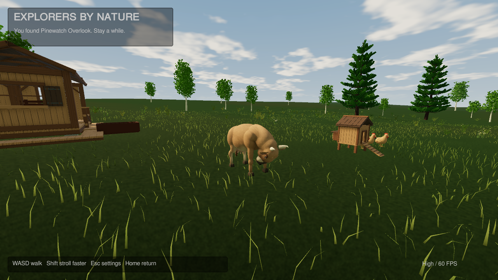
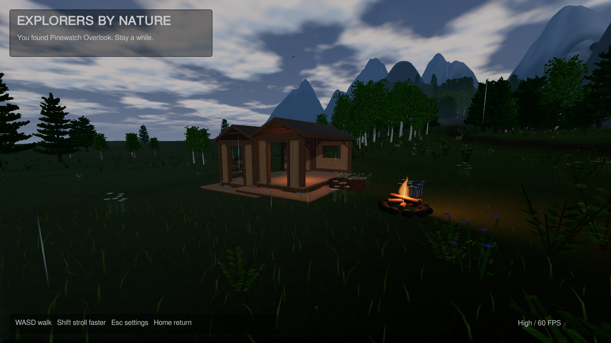

# Fuller woods and outdoor light

The forest now has ferns, folded shrub leaves, flowering stems and mossy fallen logs. Plants grow in seeded patches, with extra growth beside the trail on high quality. The ranch, river and walking corridor remain clear.

Tree leaves now respond to light through their backs and move in the wind. High quality adds ACES tone mapping, restrained bloom, sharper soft shadows and three local mist volumes that sample tree shadows. Ambient light keeps shaded ground readable. These effects use the existing URP renderer; there is no ray-traced global illumination.

Mountain crests bend into unequal summits and broad gullies. A finer distant mesh resolves the new shapes. The river has darker channels, an illustrated pebble bed, warped ripples and sky-colored reflections. The reflection is analytic; it does not mirror actual trees or buildings.

All seven modeled animals have original color and normal atlases. Clover has a revised spine, skull and eyelids; the fox has shorter ears, whiskers and cheek detail; the deer has revised eyes, jawline and branched antlers. Both skinned detail levels remain. The [animal guide](animal-animation.md) explains regeneration and contains Blender studio previews.

[Short fox motion capture](benchmarks/lush-fox-motion.mp4). The recording camera follows the fox; ordinary play keeps the explorer's first-person camera.

These are Linux player captures. Low quality keeps the new plants and animal art, with reduced detail and no post-processing or local scattering volumes. The [validation ledger](first-milestone.md#lush-woodland-and-lighting-september-13-2026-utc) records measurements, tests and build identity. Native Windows execution and the intended minimum PC still need testing.
