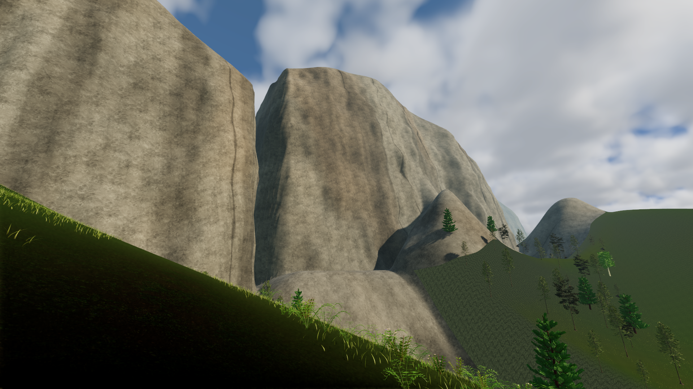
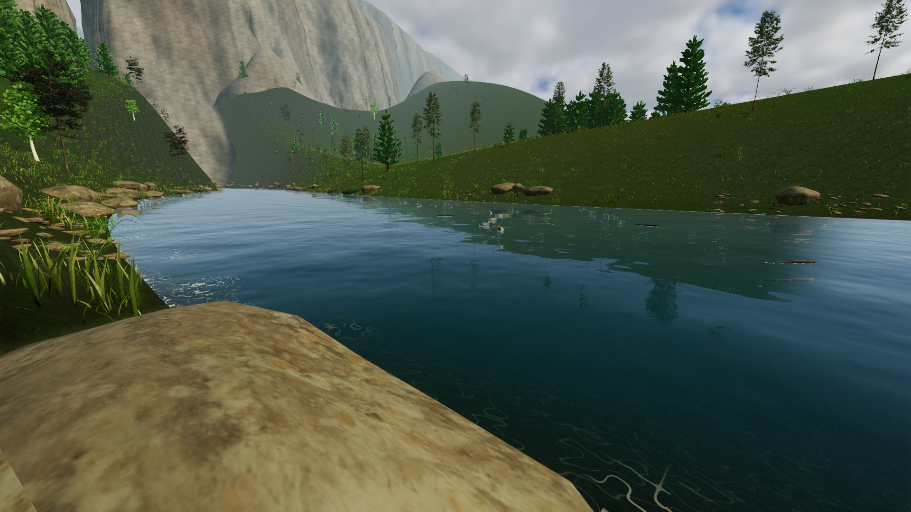

# Granite valley vistas

The northern skyline now uses broad granite masses with steep valley walls, rounded shoulders, recessed joints and low talus aprons. A lower watershed sits farther behind them. High adds a conifer belt below the walls to establish scale. Granite shading combines the existing photographed mineral texture with irregular dark joints, rain stains and oxidized patches; nearby summer cliffs no longer receive snow at low elevations.

This is a fictional valley inspired by two parks, not a reconstruction. Yosemite supplies the nearby cliffs and domes. Yellowstone supplies the idea of open foreground country with layered mountains beyond it. Their geology differs: the National Park Service describes Yosemite's granite and glacially carved valley, while Yellowstone's Absaroka Range records older volcanic activity. References checked September 13, 2026: [Yosemite geology](https://www.nps.gov/yose/learn/nature/geology.htm), [Yosemite rockfall and joints](https://www.nps.gov/yose/learn/nature/rockfall.htm), [Yellowstone volcanism](https://www.nps.gov/yell/learn/nature/volcano.htm). These references guide shape and material choices; they do not validate a geological simulation.

Walk to Pinewatch Overlook or press **F7** for the river. **High** includes the extra conifers. The rock geometry appears on both quality presets.

[Build and capture evidence](validation/mountains-builds.json). These mountains remain visual scenery above the existing authoritative terrain. This pass adds no climbing routes and does not change saved ranches, collision heights or shared gameplay. Windows is cross-built; native execution remains unverified. The capped captures are visual checks, not performance benchmarks.
