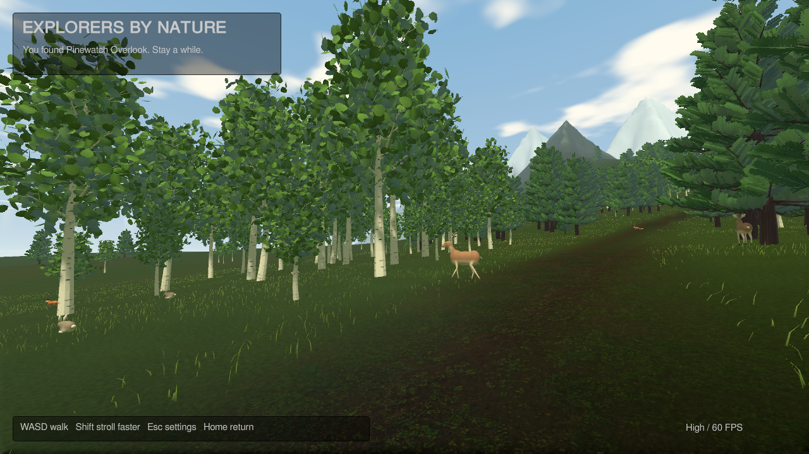
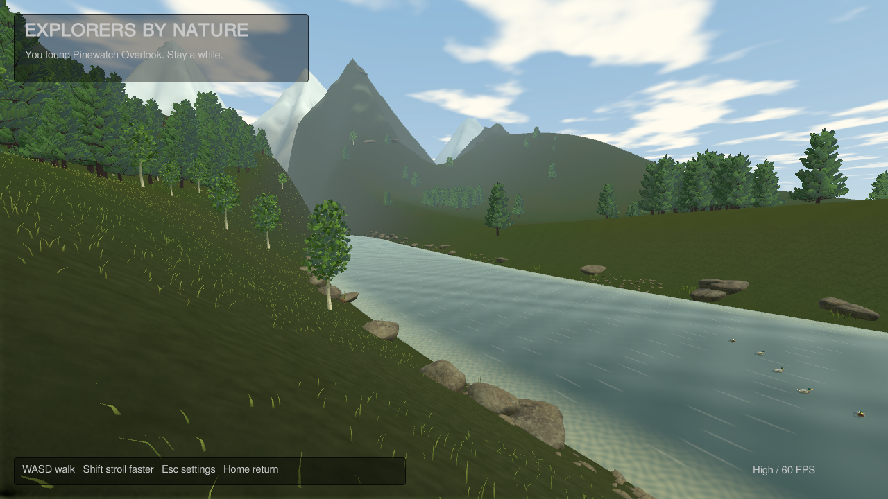
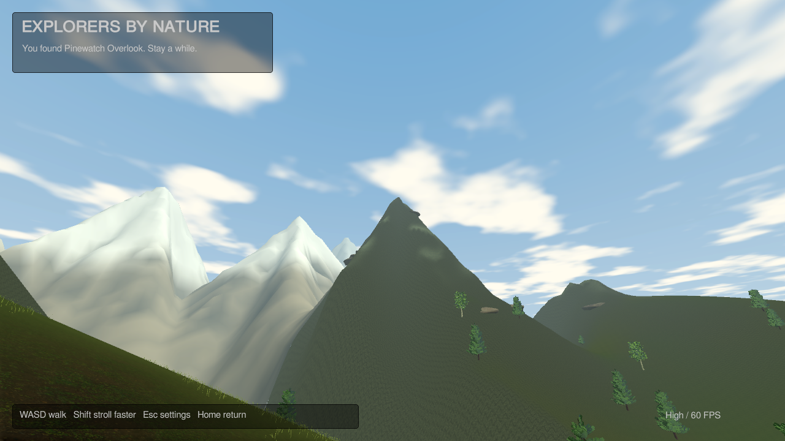
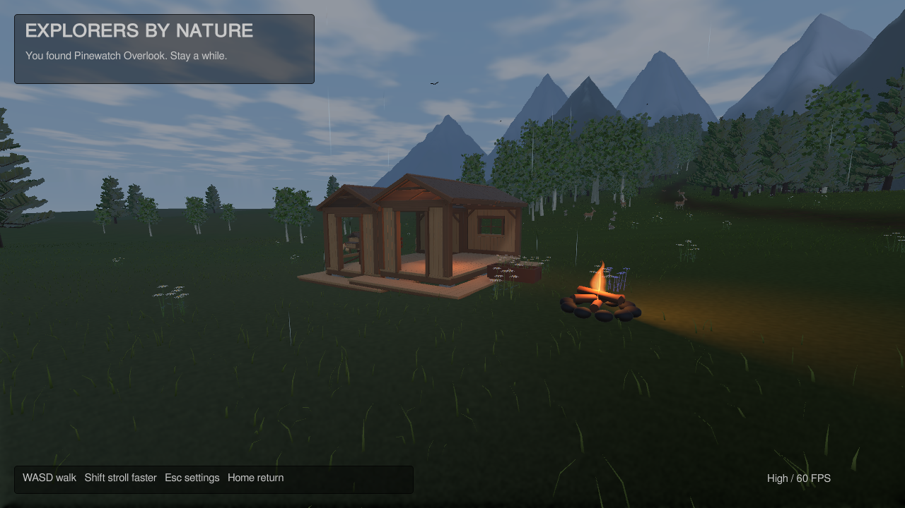
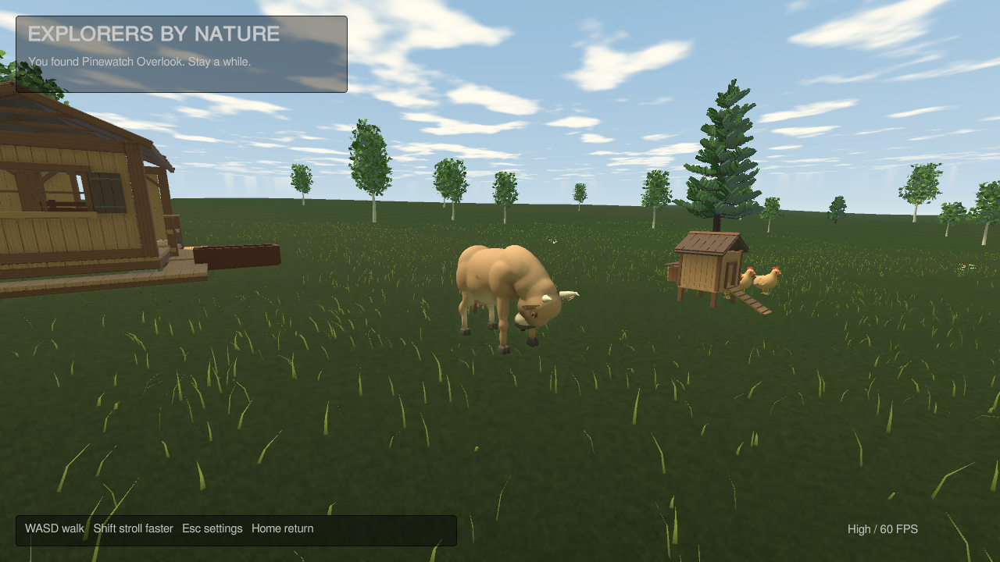
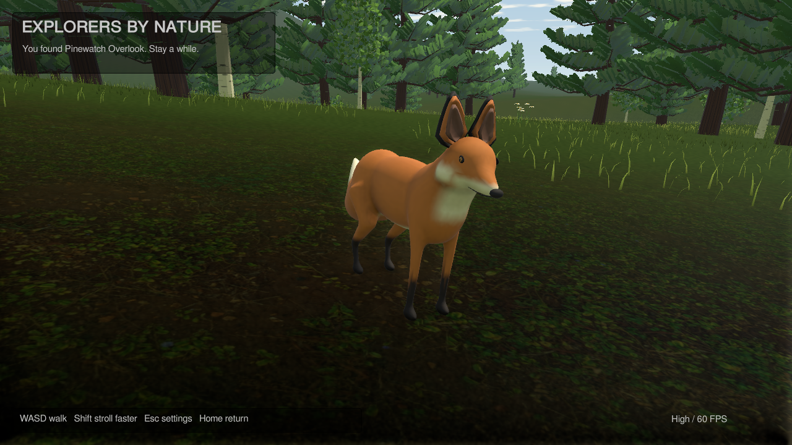

# A quieter, livelier Pinewatch

This pass completes the eight planned nature and homestead improvements. The images below are captures from the Linux player, with its ordinary game rendering.

| Area | What changed |
| --- | --- |
| Landscape | Layered pine/aspen groves, varied meadow cover, pointed northern ridges and distant snowy summits; the route keeps clear walking and viewing space. |
| Animal movement | All seven modeled species have shared skeletons across both LODs: walking, grazing, pecking, ears, tails, duck paddling and beaver grooming. Swallows flap and glide. |
| River | Depth-colored shallows, moving current highlights, pebble bars, driftwood, reeds and tree shadows. |
| Building feedback | Snapping and red/green placement previews use authority rules; accepted building and collection changes give audible feedback. |
| Sound | Spatial river, trees, animal calls and campfires; footsteps change between grass, wood, stone and water. Audio is synthesized original work. |
| Expedition | Pack at the arrival basket, picnic at the overlook, return with alpine flowers. Progress and the shared reward persist. |
| Ranch furnishings | Benches you can sit on, lanterns, troughs, planted flower boxes and animated campfires. Nearby lights share a four-light budget. |
| Weather and time | Gentle rain, moving clouds, readable nights and warm evening lighting, with clear/daylight overrides in settings. |

## Walk through the woods

## Come home in the evening

## Watch the animals

[Short fox motion capture from the player](benchmarks/polish-fox-motion.mp4). The camera follows the animal for this recording; ordinary play uses the explorer's first-person camera.

The [playtest guide](morning-playtest.md) covers all controls. [Animal animation](animal-animation.md), [terrain](terrain-polish.md), and [the shared expedition](expedition-and-ranch.md) describe implementation details. The [validation ledger](first-milestone.md#complete-picnic-and-nature-polish-september-12-2026-utc) contains exact build identities and measured results.

This is still a small family prototype. Animation uses approximate procedural foot placement, water uses an opaque illustrated bed, and wildlife is local scenery. Native Windows execution, the proposed two-core/8 GB PC, and a full 20-player rendered ranch still need hardware/playtesting evidence. Continents and historical routes remain outside this valley release.
