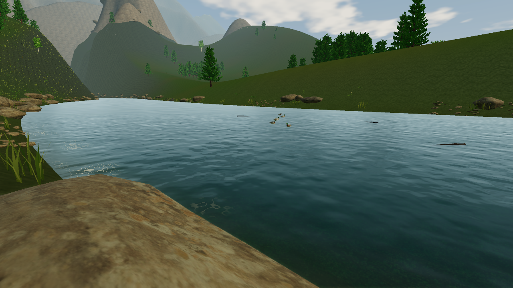
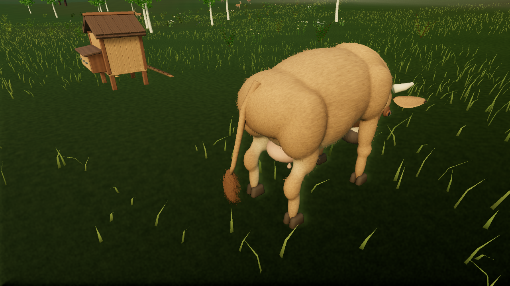

# Wind, fur and river motion

Press **F7** to visit the river and **G** to toss a pebble. Ripples spread through the nearby water, floating branches follow the current, and walking into the shallows disturbs the surface. Deep water supports the player without a drowning timer.

**Escape** settings offer calm, breeze and gusty wind. Trees, fern fronds and grass respond to the same moving wind field. The tree and fern shadow passes bend with their geometry.

The doe, roaming deer, cow, fox and rabbit have short coat clumps attached to their animated skin. Each clump has a damped spring that responds to wind and body movement. The cow’s tail switch has longer hair. High uses up to 1,800 clumps per nearby animal, Low up to 600, with shorter viewing distance. The underlying animal stays present on both presets.

[High motion recording](benchmarks/wind-water-high-motion.mp4) · [Integrated graphics motion recording](benchmarks/wind-water-low-motion.mp4)

These are unedited frames from the Linux player, recorded at a fixed 24 simulation frames per second. They show motion, not measured performance.

The river uses a local 48 × 72 metre shallow-water wave field with depth-aware propagation, current advection, pebble impulses and buoyancy. The active field follows the player, preserving waves in the overlapping area and retaining nearby floating branches. Newly reached water starts undisturbed. Distant water uses animated surface shading. High adds scene-color refraction; Low uses an approximate riverbed. Sky reflections are approximate. This is surface-water interaction, without flooding, terrain erosion or a full three-dimensional fluid solver.

Hair uses crossing ribbon clumps with simulated tips, without strand collisions or self-collision. Water disturbances, driftwood and hair are local visual effects, not shared persistent multiplayer objects. [Validation and hardware limits](first-milestone.md).
