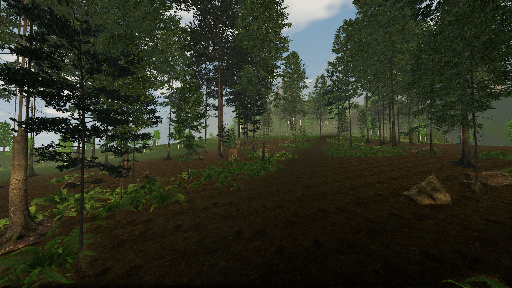
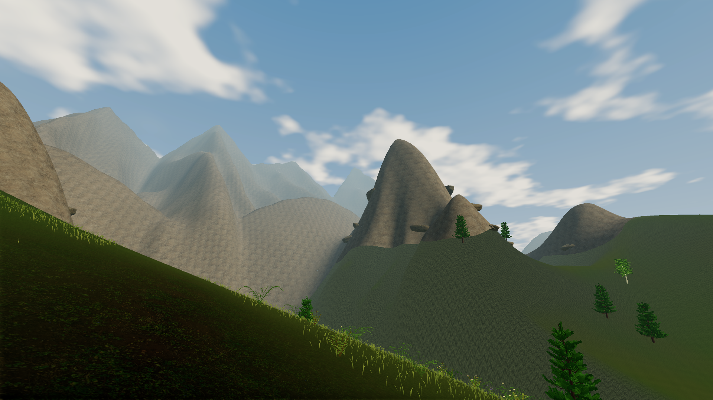

# Woodland and alpine refinement

This pass extends Fern Hollow's tree art into the nearest surrounding forest and adds rock-face detail to the northern mountains. Press F8 to enter the grove, F9 to hide the HUD, and Home to return to the ranch. The picnic trail leads north to the overlook.

The transition replaces up to 56 nearby prototype canopies at their existing planting positions. Their trunk collisions stay in place. Small mossy rock groups break up the bare trail shoulders, and the forest-floor boundary varies around the planting. Daylight uses more ambient fill and slightly less direct sun to keep shaded ground readable.

The new distant range has connected, unequal summits. Photographed granite and slope-dependent snow cover the northern high ground. The rock texture is the existing CC0 Poly Haven `rock_boulder_dry` photograph recorded in [asset provenance](assets.json). The mountain treatment preserves the existing walkable terrain, including its rounded summit profiles. Those profiles still limit the result.

The doe revision focuses on its ears, neck, muzzle and coat. The source remains original procedural Blender art. See [authoring notes](../ArtSource/ReferenceDeer/README.md) for its limitations and reference links.

## Player gallery





[Close doe view](benchmarks/woodland-doe.png) · [Forest floor](benchmarks/woodland-detail.png) · [720p Low on integrated graphics](benchmarks/woodland-low.png)

## Inspection

The capture tool now records six normal first-person views, including a close view of the doe and a view from Pinewatch Overlook. It isolates saves and preferences. Images are captured from the player without image editing.

```sh
python3 .agents/tools/grove-capture.py --quality high
python3 .agents/tools/grove-capture.py --quality low --width 1280 --height 720 --vulkan-device-index 1
```

Measurements and platform checks are recorded in the [validation ledger](first-milestone.md). The earlier [Fern Hollow release](fern-hollow.md) retains its own screenshots and evidence for comparison.
